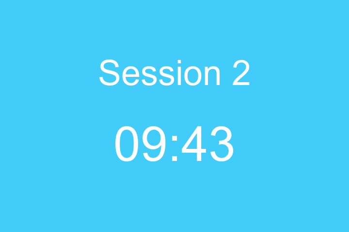

# Pomodoro video

Creates a video time tracker for Pomodoro. Uses Pillow and FFMpeg

### Create environment
python -m venv venv
venv\Scripts\activate
pip install -r requirements.txt

### Run python script
python run.py

### Create the video using ffmpeg
ffmpeg -framerate 1  -i "%04d.png" -c:v libx264 -pix_fmt yuv420p out.mp4
